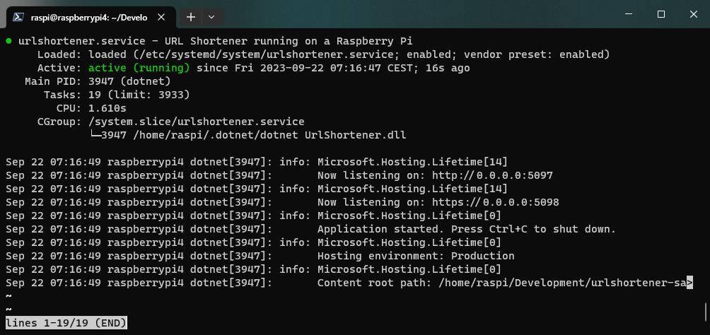

# URL Shortener as Service on a Raspberry Pi

This repository contains a simple URL Shortener using .NET 7 and the minimal API approach. Although it contains a [urlshortener.service](urlshortener.service) file to be able to run the URL Shortener Web API as a service on a Raspberry Pi.


## Usage

The Web API provides two endpoints:

- `POST https://<YOUR-IP-ADDRESS>:5098/add` - Creates a shortened version of an URL
    - Body: `{"url":"YOUR URL"}`
- `GET https://<YOUR-IP-ADDRESS>:5098/{ShortUrl}` - Gets the long version of an URL

## Sample

There is a [Postman](https://www.postman.com/) collection located in the [*Samples*](./samples/) folder. This collection contains all the different endpoints of the API if you are running the project locally.

## Service

*Make sure that .NET 7 is installed on your Raspberry Pi, before continuing with the instruction.*

To be able to auto start the project as a service on a Raspberry Pi there is a file called [urlshortener.service](urlshortener.service) in the root path of the project.

This file contains a definition to be able to run as service and has the following content

```
[Unit]
Description=URL Shortener running on a Raspberry Pi

[Service]
ExecStart=/home/raspi/.dotnet/dotnet UrlShortener.dll
WorkingDirectory=/home/raspi/Development/urlshortener-sample/src/UrlShortener/bin/Release/net7.0/
User=raspi

[Install]
WantedBy=multi-user.target
```

You just need to update your Raspberry Pi user name. In my case it is `raspi` and you need to adjust the `WorkingDirectory`. The path should contain the `.dll` files of our project.

### Enable / Start / Stop / Disable the Service

First you need to copy the `urlshortener.service` file to `/etc/systemd/system/` by using the `cp` command.

```bash
sudo cp urlshortener.service /etc/systemd/system/
```

We are using `systemctl` to control the lifecycle of our service.

```bash
# enables the service
sudo systemctl enable urlshortener.service

# starts the service
sudo systemctl start urlshortener.service

# checks the current status of the service
sudo systemctl status urlshortener.service

# stops the service
sudo systemctl stop urlshortener.service

# disables the service
sudo systemctl disable urlshortener.service
```

You can always check the current state of the service by running the `systemctl status` command.



*If your service is running you can simply use the IP address of the Raspberry Pi to access your URL Shortener by adding the port `5098` in your browser or Postman.*


## Buy Me A Coffee

I appreciate any form of support to keep my _Open Source_ activities going.

Whatever you decide, be it reading and sharing my blog posts, using my NuGet packages or buying me a coffee/book, thank you ❤️.

<a href="https://www.buymeacoffee.com/tsjdevapps" target="_blank"></a>

## Contributing

Pull requests are welcome. For major changes, please open an issue first
to discuss what you would like to change.

Please make sure to update tests as appropriate.

## License

[MIT](https://choosealicense.com/licenses/mit/)